<!-- AUTO_UPDATE_START -->

<em>Something base has been set over a low fire and left to cook down, its old shape dissolving by slow degrees, and what gathers at the bottom of the vessel comes out heavier and stranger than what first went in.</em>

witnessed the twenty-second of july

<!-- AUTO_UPDATE_END -->
